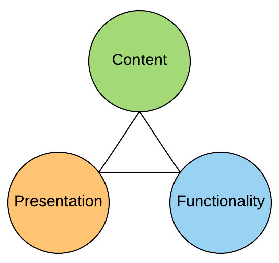

# Intro-Web-Development 

## Tools/Accounts

You will need a **GitHub Account**; if you don't already have one, [sign up here](https://github.com/join?source=header-home). You will also need to install [Visual Studio Code](https://code.visualstudio.com/).

## Resources

- [What is GitHub?](https://www.youtube.com/watch?v=w3jLJU7DT5E)
- [Code Editing with VS Code](https://code.visualstudio.com/docs/introvideos/codeediting)
- [Introduction to GitHub](https://lab.github.com/githubtraining/introduction-to-github) - Lab
- [What is HTML?](https://www.html-5-tutorial.com/about-html.htm)
- [What it's Not](https://www.html-5-tutorial.com/what-its-not.htm)
- [Hello World](https://www.learn-html.org/en/Hello%2C_World%21)
- [Basic elements](https://www.learn-html.org/en/Basic_Elements)
- [Links](https://www.learn-html.org/en/Links)
- [Lists](https://www.learn-html.org/en/Lists)
- [Images](https://www.learn-html.org/en/Images)
- [Styles](https://www.learn-html.org/en/Styles)
- [Classes](https://www.learn-html.org/en/Classes)
- [Selectors](https://www.learn-html.org/en/Selectors)
- [Pseudo-classes](https://www.learn-html.org/en/Pseudo-classes)
- [Page Layout with CSS Grid]
- [Uploading your project to GitHub](https://lab.github.com/githubtraining/uploading-your-project-to-github) - Lab
- [Introduction to HTML](https://lab.github.com/githubtraining/introduction-to-html) - Lab
- [WOT Fan Site Kit](https://console.worldoftanks.com/en/content/docs/world-of-tanks-fankit/)

## Tasks

- Build a Typography Page

## LOGs

*At the end of this topic, you should be able to:*

- List the core programming languages used on the web
- Define the terms HTML, CSS and JS
- Identify which programming language is responsible for representing content in a web page
- Identify which programming language handles the presentation ("look and feel") of a web page
- Identify which programming language provides functionality in a web page
- Explain the meaning of the following diagram

  

- Explain the meaning of the following diagram

  

----

----

### Badges

Custom badges for indicating documentation status and code status are generated from the [**Shields.io**](https://Shields.io) website. Here are a few samples.

> 
>
> 
>
> 
>
> 
>
> 
>
> 
>
> 
>
> 
